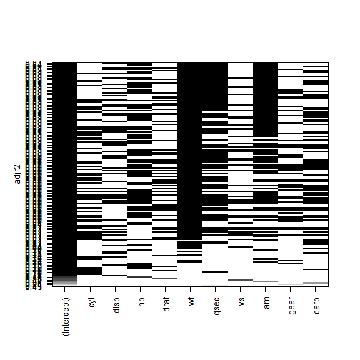

### Introduction

1. Presentation is based on Regression Models Project for fuel consumption from the Regression Models course.
2. We estimate fuel consumption based on three key variables:
  1. Weight of vehicle in pounds (wt) 
  2. Quarter mile time in seconds (qsec)
  3. Transmision type, automatic of manual gearbox (am)
3. Dynamic results are shown in [shinyapps.io/FuelConsumption](https://swannsg.shinyapps.io/FuelConsumption/)

---

### Regression model for _mtcars_ (Part 1 of 3)


```r
  library(datasets)
  data(mtcars)
```

Convert _am_ to factor variable.


```r
d = mtcars
#--transmission type
d$am = factor(d$am,
              levels=c(0,1),
              labels=c('auto', 'manual'))
```

We optimise the regression model automatically using the _leaps_ library.


```r
library(leaps)
leaps=regsubsets(mpg ~ ., data=mtcars, nbest=20)
```

---

### Regression model for _mtcars_ (Part 2 of 3)


```r
#--optimise adjusted-R2
plot(leaps, scale="adjr2")
```

 


---

### Regression model for _mtcars_ (Conclusion)

The vertical black bands indicate important regressors.
From the plot in the previous slide we can see *wt*, *qsec* and *am* should be included.

The model becomes:


```r
model = lm(mpg ~ wt + qsec + am, data=d)
```

We can make predictions using new.data. In the Shiny application the new.data is provided by the slider and text inputs. For **result**, lower bound is 'lwr', upper bound is 'upr', and most likely value is 'fit'. 


```r
new.data = data.frame('wt'=c(2000/1000), 'qsec'=c(18), 'am'='auto')
result = predict(model, new.data, interval='prediction', level=0.95)
print (result)
```

```
##        fit     lwr      upr
## 1 23.85072 18.0523 29.64915
```
